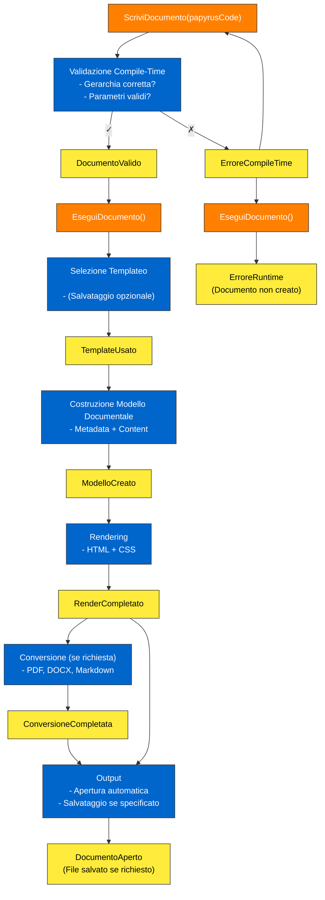
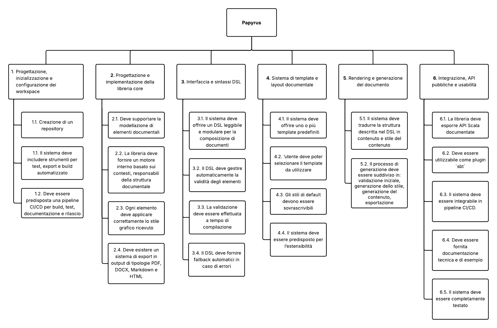

# Allegato 2 - Requirements Breakdown Structure

## Event Storming

Event Storming per la definizione dei requisiti del sistema, sono riportate solo alcune azioni per motivi di spazio, ma il processo è stato molto più ampio e dettagliato.

## Requirements Breakdown Structure

Vengono qui di seguito esplosi i requisiti del sistema, a partire dagli obiettivi definiti nel [POS](../process/Allegato-1.md) e sulla base dell’Event Storming effettuato, nel formato di una Requirements Breakdown Structure.

1. Progettazione, inizializzazione e configurazione dei workspace
   1. Creazione di un repository
   2. Il sistema deve includere strumenti per test, export e build automatizzato.
   3. Deve essere predisposta una pipeline CI/CD per build, test, documentazione e rilascio.

2. Progettazione e implementazione della libreria core
   1. Deve supportare la modellazione di elementi documentali, ognuno con funzioni di rendering dello stile e del contenuto.
   2. La libreria deve fornire un motore interno basato sui contesti, responsabili della struttura documentale.
   3. Ogni elemento deve applicare correttamente lo stile grafico ricevuto, con possibilità di override locale o globale.
   4. Deve esistere un sistema di export in output di tipologie PDF, DOCX, Markdown e HTML.
   
3. Interfaccia e sintassi DSL
   1. Il sistema deve offrire un DSL leggibile e modulare per la composizione di documenti.
   2. Il DSL deve gestire automaticamente la validità della gerarchia degli elementi.
   3. La validazione deve essere effettuata a tempo di compilazione bloccandone l'esecuzione.
   4. Il DSL deve fornire fallback automatici in caso di errori.

4. Sistema di template e layout documentale
   1. Il sistema deve offrire uno o più template predefiniti con scelte coerenti di stile (font, margini, colore, allineamento).
   2. L’utente deve poter selezionare il template da utilizzare tramite i metadati del documento.
   3. Gli stili di default devono essere sovrascrivibili a livello globale o per singolo elemento.
   4. Il sistema deve essere predisposto per l’estensibilità, consentendo in futuro l’aggiunta di template personalizzati.

5. Rendering e generazione del documento
   1. Il sistema deve tradurre la struttura descritta nel DSL in contenuto e stile del contenuto.
   2. Il processo di generazione deve essere suddiviso in: validazione iniziale, generazione dello stile, generazione del contenuto, esportazione.

6. Integrazione, API pubbliche e usabilità
   1. La libreria deve esporre API Scala documentate per l’uso in progetti esterni.
   2. Deve essere utilizzabile come plugin `sbt`, con comandi espliciti per generazione e apertura documenti.
   3. Il sistema deve essere integrabile in pipeline CI/CD.
   4. Deve essere fornita documentazione tecnica e di esempio.
   5. Il sistema deve essere completamente testato.

