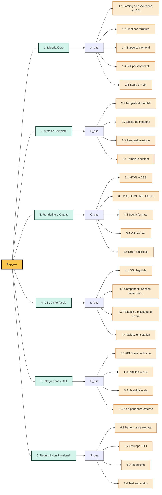

# Allegato 2 - Requirements Breakdown Structure

## Event Storming

## Requirements Breakdown Structure

Vengono qui di seguito esplosi i requisiti del sistema, a partire dagli obiettivi definiti nel [POS](../process/Allegato-1.md) e sulla base dell’Event Storming effettuato, nel formato di una Requirements Breakdown Structure.

1. Progettazione, inizializzazione e configurazione dei workspace con un adeguato build tool, di un’infrastruttura con predisposizione a una pipeline automatizzata di continuous integration & deployment.
2. Progettazione e implementazione della libreria core
   - La libreria deve interpretare ed eseguire un DSL dedicato alla generazione documentale
   - La libreria deve supportare una struttura gerarchica dei contenuti:
       - Metadati (es. titolo documento, autore, data, formato output)
       - Contenuto principale: testo, titoli, sezioni, sottosezioni, elenchi, tabelle, ecc.
   - Ogni elemento deve poter essere arricchito con stile personalizzato (es. margini, allineamento, colore, font)
   - La libreria deve essere compatibile con Scala 3 ed essere integrabile facilmente in progetti `sbt`
3. Sistema di template e layout documentale
   - Il sistema deve fornire uno o più **template predefiniti** tra cui selezionare
   - L’utente deve poter selezionare il template desiderato direttamente dai metadati
   - Ogni template deve essere personalizzabile a livello globale e per singolo elemento
   - Il sistema deve permettere in futuro l’aggiunta di template definiti dall’utente
4. Rendering e generazione del documento
   - Il contenuto deve essere tradotto in HTML + CSS come base di rendering
   - Il sistema deve supportare diversi formati di esportazione:
       - PDF (default)
       - HTML
       - Markdown
       - DOCX 
   - Il formato di esportazione deve poter essere indicato nei metadati
   - La generazione deve includere validazione semantica del contenuto
   - Gli errori di generazione devono essere gestiti con messaggi chiari e leggibili a tempo di compilazione
5. Interfaccia e sintassi DSL
   - Il DSL deve essere leggibile anche da utenti non esperti di Scala
   - Deve supportare una sintassi modulare, con componenti composabili (es. `Section`, `Table`, `List`, ecc.)
   - Deve prevedere fallback automatici o messaggi di errore comprensibili in caso di uso scorretto
   - Deve permettere la validazione statica del documento prima della generazione
6. Integrazione, API pubbliche e usabilità
   - La libreria deve esporre API Scala per uso programmatico in altri progetti
   - Deve poter essere usata come plugin o dipendenza `sbt` in progetti esistenti
   - Deve essere facilmente integrabile in CI/CD pipeline o build automation

