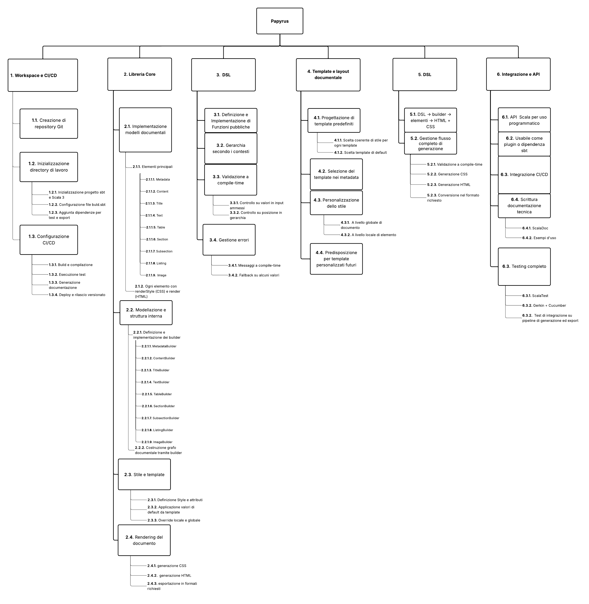

# Allegato 3 - Work Breakdown Structure

A partire dal [RBS](../process/Allegato-2.md), vengono qui di seguito esplosi i requisiti del sistema elencando le attività necessarie per soddisfarli, nel formato di una Work Breakdown Structure.

1. Progettazione, inizializzazione e configurazione dei workspace
    1. Creazione della struttura del repository Git
    2. Integrazione plugin sbt
       1. Inizializzazione progetto sbt con supporto Scala 3
       2. Configurazione file build.sbt
       3. Aggiunta delle dipendenze principali per test e export
    3. Configurazione CI/CD (GitHub Actions)
        1. Build e compilazione
        2. Esecuzione test
        3. Generazione documentazione
        4. Deploy e rilascio versionato

2. Progettazione e implementazione della libreria core
    1. Implementazione dei modelli documentali
        1. elementi principali del documento:
            1. Metadata
            2. Content
            3. Title
            4. Text
            5. Table
            6. Section
            7. Subsection
            8. Listing
            9. Image
        2. Ogni elemento implementa renderStyle (genera CSS) e render (genera HTML)
    2. Modellazione e struttura interna
        1. Definizione e implementazione dei builder
            1. MetadataBuilder
            2. TitleBuilder
            3. TextBuilder
            4. TableBuilder
            5. SectionBuilder
            6. SubsectionBuilder
            7. ListingBuilder
            8. ImageBuilder
            9. ContentBuilder
        2. Costruzione del grafo documentale ricorsivo tramite builder
    3. Gestione degli stili e template
        1. Definizione del modello Style con attributi (font, colore, margini, ecc.)
        2. Applicazione dei valori di default da template
        3. Override locale o globale tramite DSL
    4. Rendering del documento
        1. Fase 1: generazione CSS (renderStyle)
        2. Fase 2: generazione HTML (render)
        3. Esportazione nei formati richiesti (da HTML a PDF, DOCX, Markdown)
           1. Salvataggio opzionale, apertura automatica del file generato

3. Interfaccia e sintassi DSL
    1. Definizione e implementazione di tutte le funzioni pubbliche
    2. Gestione gerarchica dei contesti (es. subsection solo in section)
    3. Validazione statica
        1. Controllo su valori ammessi (es. font validi)
        2. Controllo sulla posizione e struttura degli elementi
    4. Gestione degli errori
        1. Messaggi a compile-time chiari e bloccanti
        2. Fallback su valori di default se semanticamente coerenti

4. Sistema di template e layout documentale
    1. Progettazione di template predefiniti (es. “Elegante classico”)
        1. Scelta coerente di font, margini, colori e allineamento
        2. Scelta template di default
    2. Meccanismo di selezione del template nei metadati
    3. Possibilità di personalizzazione dello stile
        1. A livello globale per l'intero documento
        2. A livello locale per singoli elementi
    4. Predisposizione per template personalizzati futuri

5. Rendering e generazione del documento
   1. Trasformazione DSL → builder → elementi → HTML + CSS
   2. Gestione del flusso completo di generazione
      1. Validazione iniziale con contesti `using` e tipi raffinati con messaggi chiari (compile-time)
      2. Generazione CSS (`renderStyle`)
      3. Generazione HTML (`render`)
      4. Conversione in formato di output richiesto

6. Integrazione, API pubbliche e usabilità
    1. Esportazione di API Scala pubbliche (solo DSL e configurazione; meccanismi interni nascosti)
    2. Integrazione come plugin sbt (comandi: generateDoc, openDoc, ecc.)
    3. Compatibilità con pipeline CI/CD
    4. Scrittura della documentazione tecnica:
        1. ScalaDoc
        2. Esempi d’uso (README)
    5. Testing completo
        1. Unit test con ScalaTest
        2. Test comportamentali con Gherkin + Cucumber
        3. Test di integrazione su pipeline di generazione ed export

