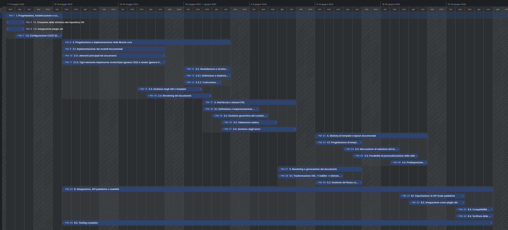

# Allegato 5 - Diagramma di Gantt

Di seguito è riportato il diagramma di Gantt del progetto, che illustra le attività pianificate e le loro durate. Questo diagramma è stato creato utilizzando il YouTrak e rappresenta visivamente la schedula del progetto.

L’ultima attività di progetto è pianificata per il 28 Giugno 2025, a cui si aggiunge un periodo di Contengency Reserve di una settimana mantenuto per eventuali ritardi. La fine ultima del progetto è prevista entro il 7 Luglio 2025, in linea con le Conditions of Satisfactions redatti in fase di definizione del progetto. 