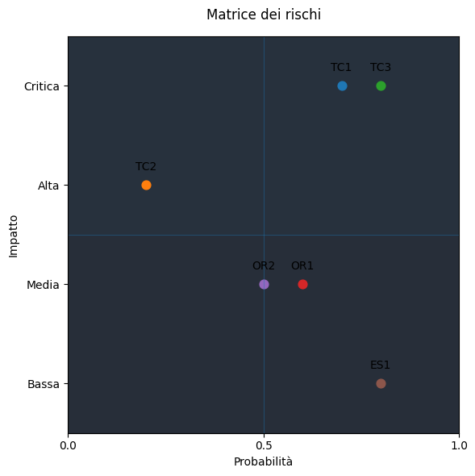

# Allegato 6 - Risk Analysis

L’analisi dei rischi ha permesso di identificare le principali criticità che potrebbero ostacolare lo sviluppo, il rilascio o l’adozione della libreria Papyrus. Ogni rischio è stato classificato per categoria (Tecnico, Organizzativo, Esterno), valutato secondo probabilità e impatto (in una scala qualitativa a quattro livelli: B = Basso, M = Medio, A = Alto, C = Critico), ed è stata assegnata una priorità in base alla gravità complessiva. Per ciascun evento è stata anche definita una strategia di gestione (mitigazione o accettazione).

## Identificazione dei rischi

### TECNICI

- **TC1** – Mancanza di qualità dovuta all’inesperienza del team di sviluppo con Scala 3.  
  La scarsa familiarità iniziale con il linguaggio può influire negativamente sulla struttura del progetto, sulle performance e sulla manutenibilità del codice.

- **TC2** – Difficoltà nell’uso delle tecnologie CI/CD per il rilascio in produzione.  
  Una conoscenza limitata degli strumenti di integrazione e distribuzione continua potrebbe causare ritardi nella pubblicazione e nelle fasi finali.

- **TC3** – Uso improprio o inefficace delle tecnologie adottate.  
  Un utilizzo non ottimale delle librerie o dei framework integrati può portare a ridotta flessibilità del sistema e maggiore complessità nella gestione dei moduli.

### ORGANIZZATIVI

- **OR1** – Sforamento del budget orario.  
  Il team potrebbe impiegare più tempo del previsto rispetto al monte ore stimato, rischiando il mancato rispetto delle tempistiche complessive.

- **OR2** – Ritardi nella consegna dovuti alla sovrapposizione con altri progetti.  
  L’impegno in altri lavori paralleli (universitari o personali) può diminuire la disponibilità dei membri, influenzando negativamente la continuità del progetto.

### ESTERNI

- **ES1** – Scarso interesse da parte degli utenti finali.  
  È possibile che la DSL non incontri l’interesse previsto o non venga percepita come utile da parte di potenziali utilizzatori.

## Valutazione dei rischi

| Categoria     | Ambito   | Codice | Evento                                              | Probabilità | Impatto | Priorità |
|---------------|----------|--------|------------------------------------------------------|-------------|---------|----------|
| Tecnico       | Qualità  | TC1    | Inesperienza del team con Scala 3                   | 0.7         | C       | A        |
| Tecnico       | Qualità  | TC2    | Difficoltà con le tecnologie CI/CD                  | 0.2         | A       | A        |
| Tecnico       | Qualità  | TC3    | Uso improprio delle tecnologie adottate             | 0.8         | C       | C        |
| Organizzativo | Budget   | OR1    | Sforamento del budget orario previsto               | 0.6         | M       | B        |
| Organizzativo | Tempi    | OR2    | Rischio di ritardi a causa di impegni esterni       | 0.5         | M       | B        |
| Esterno       | Mercato  | ES1    | Basso interesse degli utenti finali                 | 0.8         | B       | B        |

## Gestione dei rischi

| Codice | Strategia | Descrizione della gestione                                                          |
|--------|-----------|-------------------------------------------------------------------------------------|
| TC1    | Mitigare  | Programmazione di momenti formativi interni e studio condiviso su Scala 3           |
| TC2    | Mitigare  | Introduzione graduale delle tecnologie CI/CD con esercitazioni pratiche             |
| TC3    | Mitigare  | Scambio di buone pratiche e approfondimento delle strutture funzionali idiomatiche  |
| OR1    | Mitigare  | Monitoraggio continuo della tabella di marcia e flessibilità sugli sprint           |
| OR2    | Accettare |                                                                                     |
| ES1    | Mitigare  | Raccolta di feedback tramite piccoli focus group per validare le scelte progettuali |

---

Questa analisi ha rafforzato la consapevolezza del team rispetto alle possibili criticità e ha guidato l’impostazione delle strategie organizzative. L’utilizzo di uno sviluppo iterativo (Scrum) e di strumenti di condivisione interna ha permesso di anticipare alcuni dei rischi tecnici e di mantenere sotto controllo quelli di tipo organizzativo e di mercato.